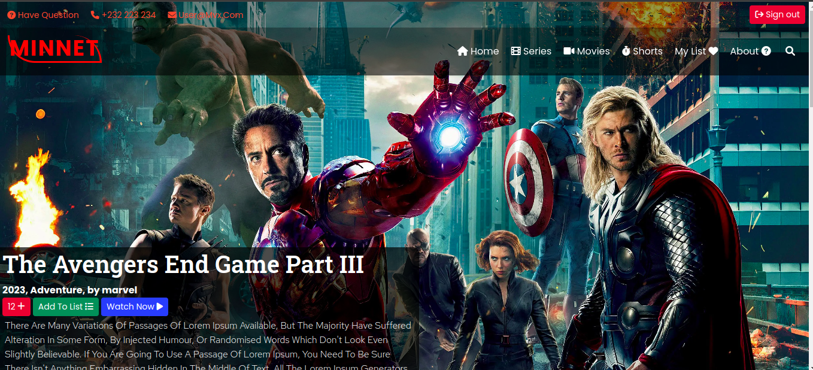
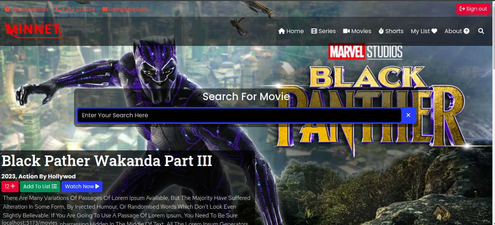
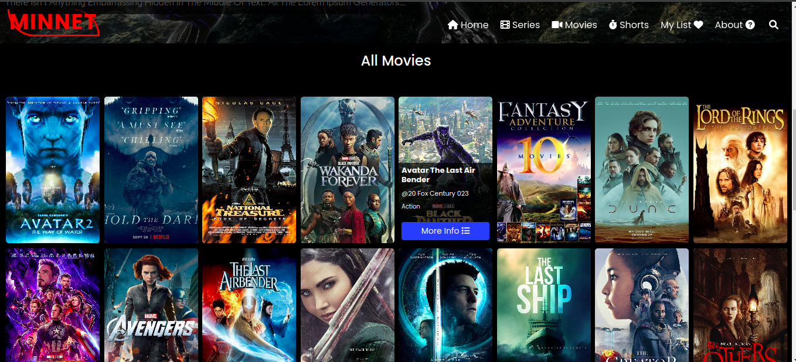
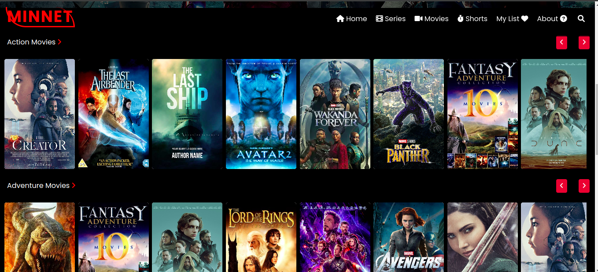
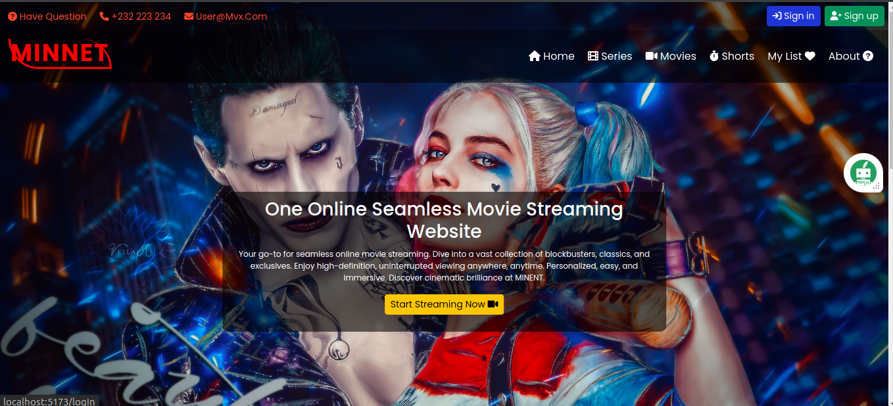

Certainly! Here's a README file for the MINNET streaming movie website:

---

# MINNET Movies - Streaming Website

MINNET Movies is an online streaming platform built using React, Express, MySQL, Axios, CORS, and various authentication methodologies. The website is designed with Bootstrap for styling and incorporates Font Awesome for icons.

### Demo Preview
[](https://www.canva.com/design/DAF3a_fFvIM/8Gz_hP9sToxyhZKDV3Dh0w/watch?utm_content=DAF3a_fFvIM&utm_campaign=designshare&utm_medium=link&utm_source=editor)

### Screen Shots
``**Movie Home page with open search bar**``


``**All Movie Selection**``


``**Movie Selection with slider**``


``**Welcome Page**``


### Requirements
Ensure the following are installed and set up:
- MySQL Server
- Node.js
- Import the provided database file located in the `Db` directory

### Usage

1. Clone the repository:
   ```bash
   git clone https://github.com/lscblack/MINNET-Movies-streaming-website.git
   cd MINNET-Movies-streaming-website
   ```

2. Install dependencies:

   - Client:
     ```bash
     cd client
     npm install
     ```

   - Server:
     ```bash
     cd ../server
     npm install
     ```

3. Start the client:
   ```bash
   cd ../client
   npm run dev
   ```

4. Start the server:
   ```bash
   cd ../server
   npm start
   ```

### Author
- **LSCBLACK (Loue Sauveur Christian)**

### License
This project is licensed under the MIT License.

---

